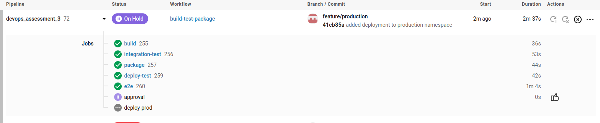
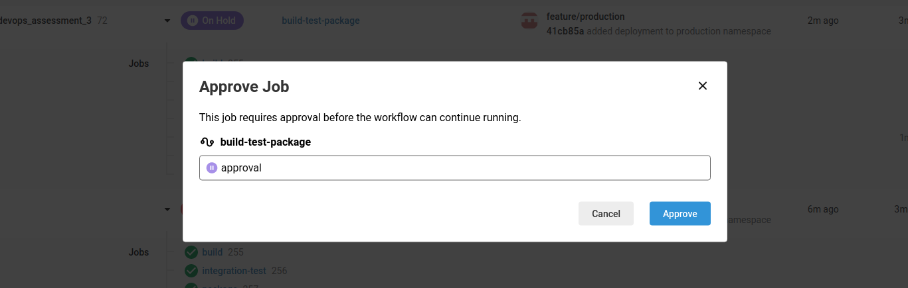
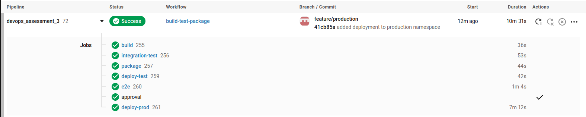
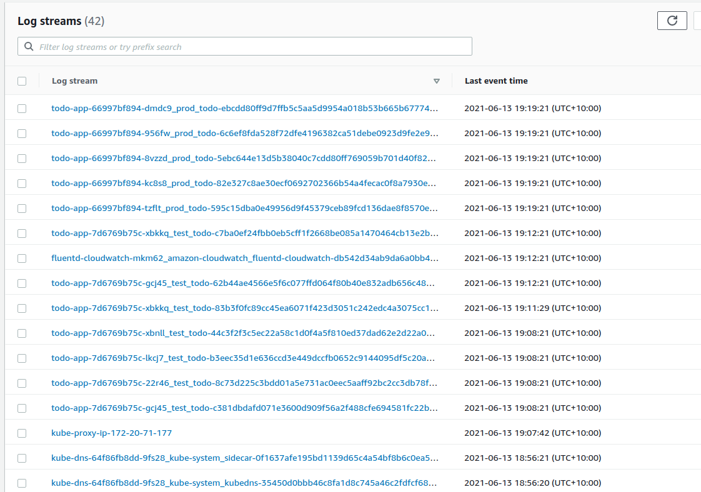

# Simple Todo App with MongoDB, Express.js and Node.js
The ToDo app uses the following technologies and javascript libraries:
* MongoDB
* Express.js
* Node.js
* express-handlebars
* method-override
* connect-flash
* express-session
* mongoose
* bcryptjs
* passport
* docker & docker-compose

## What are the features?
You can register with your email address, and you can create ToDo items. You can list ToDos, edit and delete them. 

# How to use
First install the depdencies by running the following from the root directory:
```
npm install --prefix src/
```

To run this application locally you need to have an insatnce of MongoDB running. A docker-compose file has been provided in the root director that will run an insatnce of MongoDB in docker. TO start the MongoDB from the root direction run the following command:

```
docker-compose up -d
```

Then to start the application issue the following command from the root directory:
```
npm run start --prefix src/
```

The application can then be accessed through the browser of your choise on the following:

```
localhost:5000
```
## Container
A Dockerfile has been provided for the application if you wish to run it in docker. To build the image, issue the following commands:

```
cd src/
docker build . -t todoapp:latest
```

## Terraform

### Bootstrap
A set of bootstrap templates have been provided that will provision a DynamoDB Table, S3 Bucket & Option Group for DocumentDB & ECR in AWS. To set these up, ensure your AWS Programmatic credentials are set in your console and execute the following command from the root directory

```
make bootstrap
```

### To instantiate and destroy your TF Infra:

To instantiate your infra in AWS, ensure your AWS Programattic credentials are set and execute the following command from the root infra directory:

```
make up -e ENV=<environment_name>
```

Where environment_name is the name of the environment that you wish to manage.

To destroy the infra already deployed in AWS, ensure your AWS Programattic credentials are set and execute the following command from the root directory:

```
make down -e ENV=<environment_name>
```

## Testing

Basic testing has been included as part of this application. This includes unit testing (Models Only), Integration Testing & E2E Testing.

### Linting:
Basic Linting is performed across the code base. To run linting, execute the following commands from the root directory:

```
npm run test-lint --prefix src/
```

### Unit Testing
Unit Tetsing is performed on the models for each object stored in MongoDB, they will vdaliate the model and ensure that required data is entered. To execute unit testing execute the following commands from the root directory:

```
npm run test-unit --prefix src/
```

### Integration Testing
Integration testing is included to ensure the applicaiton can talk to the MongoDB Backend and create a user, redirect to the correct page, login as a user and register a new task. 

Note: MongoDB needs to be running locally for testing to work (This can be done by spinning up the mongodb docker container).

To perform integration testing execute the following commands from the root directory:

```
npm run test-integration --prefix src/
```


###### This project is licensed under the MIT Open Source License

# Stonks Inc CICD solution by Benjamin Speelmeyer
## The issue 
Stonks Inc have improved their CI build to create a deployable container at the end of the pipeline. To further Stonks Inc's CI pipeline into a CICD pipeline,
I have developed a CD pipeline that will automate the deployment of Stonk's container into testing and production environments. The following documentation will
outline how the CD pipeline works and how to implement it.

### Dependencies
Tools that will need to be installed on your system:
* Terraform
* Helm
* Kubectl
* Kops
* AWS Cli

AWS credentials will need to be added to your local machine and to the Circle Ci environment variables.

## Deploy the Kubernetes cluster
From the application root directory execute the following commands:
```
make bootstrap
```
This command, will stand up the kops state bucket, terraform state file, terraform state lock table and an ECR repo for the application container to be stored in.

```
make kube-create-cluster
```
This command will create the cluster configuration

```
make kube-secret
```
This command, will an ssh keypair in order to connect to the cluster

```
make kube-deploy-cluster
```
This command, will deploy the cluster configuration to AWS. This step will take between 5 to 10 minutes, to stand up the cluster

```
make kube-validate
```
This command will check if the cluster is ready to use. Only execute the next command once this command returns ready.

```
make kube-config
```
This command will enable us to push configurations to the cluster.

```
make namespace-up
```
This command will stand up the test, prod, and logging namespaces.

```
./update_vars.sh
```
This script will update the following variables:
* ECR
* ECR repo name
* Kops state bucket
* subnets ids
* VPC id 
* terraform state bucket
* terraform state lock table

For this script to work, it is important that the following files have these key values.

.circleci/config.yml line:34
```
kops export kubecfg rmit.k8s.local --state s3://<<kops_bucket_name>>
```
.circleci/config.yml line:111
```
kops export kubecfg rmit.k8s.local --state s3://<<kops_bucket_name>>
```
.circleci/config.yml line:133
```
ECR: <<ECR>>
```
.circleci/config.yml line:134
```
ECR: <<ECR>>
```
infra/terraform.tfvars
```
subnet_ids = [
    "<<subnet_id_0>>",
    "<<subnet_id_1>>"
]
username = "testuser"
password = "testpassword"
vpc_id = "<<vpc_id>>"
name = "todo-db"
```
infra/Makefile line:8
```
terraform init --backend-config="key=state/${ENV}.tfstate" --backend-config="dynamodb_table=<<state-lock>>" --backend-config="bucket=<<state-file>>"
```
## Circle CI config 
After you commit to Github, the CircleCi pipeline will be triggered. In the following I will explain the steps in the pipeline.

### Build
In the build step, the unit and lint tests are run
### Intergration test
In this step the intergration tests are run
### Package
In the package step the following is completed:
* ECR and Reponame environment variables and parsed in.
* AWS cli and helm are installed
* The application is built into a Docker image
* The Docker image is saved to the ECR repo and the image name is output to a text file in the artifacts file
* The Helm folder is packaged and saved to the artifacts folder
* The infra folder containing the terraform for the database is copied to the artifacts folder
* The artifacts folder is saved under the root directory for use in the next steps
### Deploy-test
In the Deploy-test step, the test ennvironment is deployed and the following is completed:
* The ENV environment variable is set to "test"
* The setup-cd job is execute to install all dependencies
* The Terraform files are executed and begin to standup the infrastucture in the cluster
* The database endpoint, username and password are joined to create the mongodb connection string, which is saved to a text file
* The Helm package is deployed to the cluster with the db connection string and image id being parsed in.
* The somketest is executed with a 150 second sleep command to give the load balancer time to standup.
### e2e
The e2e step, runs the end to end tests against the test environment only
### Approval
The approval step, the pipeline is haulted and awaits approval before continuing to the deploy-prod step, as shown below.



### Deploy-prod
The Deploy-prod step is identical to the deploy-test step though it is deployed into the production namespace in the cluster. The smoketest is also run against this environment but the end to end test is not

## Logging
Logging has been implemented for the cluster, as shown by the below screenshot of cloudwatch.

This was accomplished via the code below:
```
deploy-logging:
	aws iam attach-role-policy --role-name nodes.rmit.k8s.local --policy-arn arn:aws:iam::aws:policy/AdministratorAccess
	kubectl create configmap cluster-info --from-literal=cluster.name=rmit.k8s.local --from-literal=logs.region=us-east-1 -n amazon-cloudwatch
	kubectl apply -f fluentd.yaml
```
The amazon-cloudwatch namespace was created at the begining of the pipeline, with the make namespace-up command and the fluentd.yml file as already been added to the repo so there is no need to download it.

## Final information

